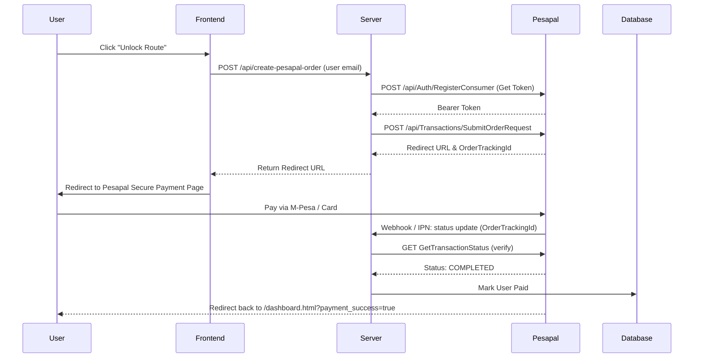

# Implementation Plan - Pesapal v3 Gateway Integration for East Africa

This plan details the replacement of Stripe Checkout with **Pesapal v3** to support local mobile money (M-Pesa, Tigo Pesa, Airtel Money, HaloPesa) and card payments in Tanzania.

---

## 🏗️ Architectural Adaptations

### 1. Backend API Routing (`server.js` Updates)
- We will replace the Stripe import with a custom Pesapal helper module or inline API functions.
- The backend will expose:
  - `POST /api/create-pesapal-order`: Calls Pesapal's `SubmitOrderRequest` to get a checkout URL.
  - `POST /api/pesapal-ipn`: The Instant Payment Notification (IPN) webhook that receives status updates from Pesapal and updates user records in Firestore.
  - `GET /api/pesapal-callback`: The redirect destination where users land after payment. It queries the transaction status and redirects the user back to the dashboard with success/cancel flags.

### 2. Pesapal v3 REST Flow

---

## 🔒 Security & Key Management Strategies

To ensure that private keys, credentials, and payment states are completely secure, we will implement the following strategies:

### 1. Zero-Exposure Client-Side Design
- **No Private Keys in Frontend**: The client-side code (`index.html`, `dashboard.html`, `app.html`) will have **zero visibility** of your Pesapal Consumer Key, Consumer Secret, or Firebase Service Account keys.
- **Backend Proxying**: All sensitive interactions (authenticating with Pesapal, registering webhook IPNs, submitting transaction details, and querying payment status) are performed strictly **server-to-server** (`server.js` communicating directly with Pesapal APIs).

### 2. Strict Environment Variable Configuration
- **Dotenv Isolation**: Sensitive credentials will be loaded dynamically into the Node.js environment memory using the `dotenv` package.
- **Git Protection**: We will store credentials locally in a `.env` file that is added to `.gitignore` so it is never committed to GitHub.
- **Production Host Injecting**: On production hosts (Render, Heroku, Railway), keys will be configured inside the host's secure **Environment Variables / Config Vars** management panel.

### 3. Server-Controlled Database Authorization
- **Read-Only / Protected Fields**: Database attributes like `hasPaid: true` will be protected. Clients will not be allowed to write or edit their own payment status.
- **Admin Verification**: Only the backend server, authenticated using the Firebase Admin SDK (`firebase-admin` certified via a secure private key file), can write to Firestore to authorize a user's route access.

---

## 📋 Credentials & Details Needed from You

To proceed with building and testing this payment system, please provide or configure the following details:

### 1. Pesapal Developer Credentials
Please sign up on [Pesapal Developer Sandbox](https://cyb3r.pesapal.com/developer-sandbox) (for testing) and register an app to generate:
- **Consumer Key**
- **Consumer Secret**
- **Mode**: Sandbox (Testing) or Production (Live)

### 2. Pricing & Currency
- Since Stripe used **GBP (£6.00)**, would you like to price the Arusha Street Safari in local Tanzanian Shillings (**TZS**), or **USD**?
  - *Recommendation*: **15,000 TZS** or **20,000 TZS** is standard for local mobile money payments.

### 3. IPN (Instant Payment Notification) Webhook URL
- Pesapal requires registering an IPN URL. If you deploy your backend to a public server (e.g. Render, Railway, or Heroku), the IPN URL will look like:
  `https://your-backend-app.com/api/pesapal-ipn`
- For local testing, we can use a tunnel tool like **ngrok** to forward webhook notifications to your local machine port 8080.

---

## 🛠️ Verification Plan
- **Sandbox Test Accounts**: We will use Pesapal's simulated mobile money prompts (M-Pesa/Tigo Pesa sandbox numbers) to complete payments and verify that webhook triggers successfully update user accounts in the database.
